# boost

## 电路拓扑结构

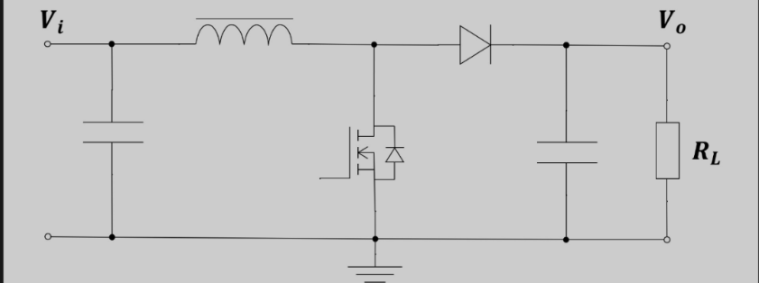

## 工作原理

[工作原理链接](https://t.im/12w2m)

## 电感

基本公式

$$
U=L\times\frac{di}{dt}
$$

$$
I = \frac{1}{L}\times\int\frac{du}{dt}
$$

由基本公式得电感电流线性变化

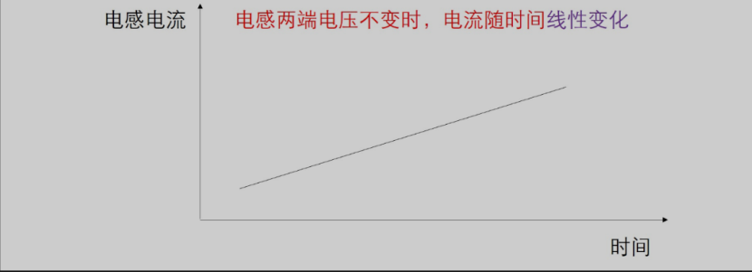

当开关管作用时

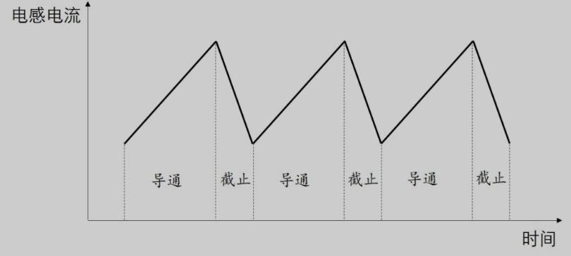

**电感电流不能超过峰值电流**

电感电流超过一定程度，电感量随电流的增大而减小

电感越小，电感电流随时间变化更快的增大，最后就会***boom***

## 选型

### 公式

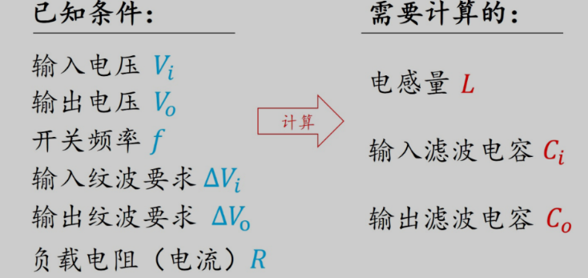

当开关导通时，电感两端电压是$V_i$

当开关断开时，电感两端电压是$V_o+V_d - V_i$

当电路稳定后，在一个周期内电感电流的增大量等于减少量

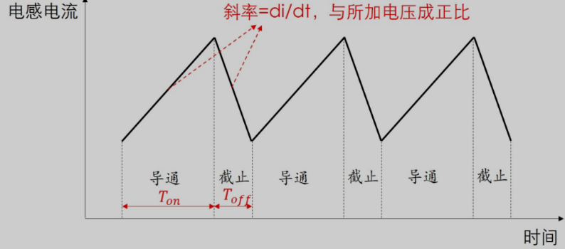

#### 伏秒法则

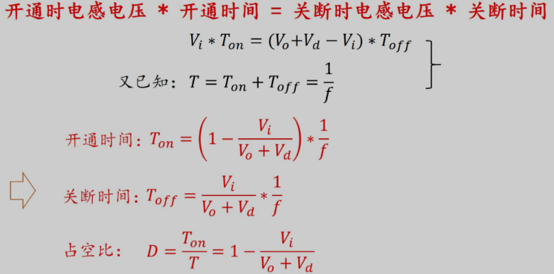

**占空比与电感量没有关系，与负载电流也没有关系，至于输入输出电压有关系**

### 功率电感选择

首先考虑**电感量**和**电感电流**

电感电感量决定电感纹波大小

当我们确定了输入输出电压，那么电感两端的电压就是确定的，那么电感电流的斜率（$U=L\frac{di}{dt}$）与电感量成反比，电感越大，斜率越小

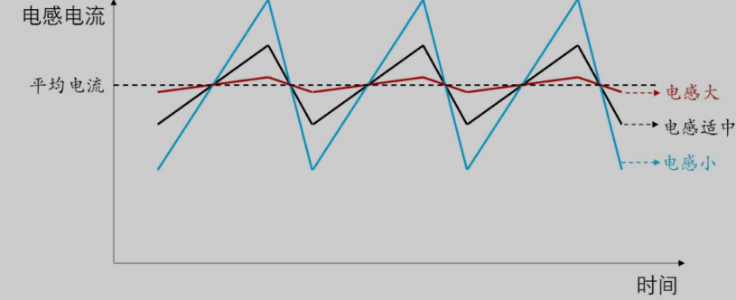

一般来说，电感量的确定，是让电感纹波电流$\Delta IL$等于电感电流的20~40%之间

电感电感量过大，电感电流纹波较小，但会导致动态响应度变差

电感电感量过小，电感电流纹波较大，电感电流峰值电流会很高，电感的过饱和电流就要很大，同时，过大的电流，在开关切换时，会导致EMI问题会更加明显

#### 电感平均电流
电感的平均电流$IL$，根据能量守恒定律，输入功率*n=输入功率（n=效率）

根据电路拓扑结构，电源所有电流都将流过电感，电源输出的平均电流就是电感的平均电流

那么

$$
IL=(V_o)\times \frac{I_o}{V_i \times n}
$$

估算时n可以取80%

忽略其他损耗，只考虑二极管的损耗

$$
IL=(V_o+V_d)\times \frac{I_o}{V_i}
$$

#### 电感纹波电流

纹波电流的大小等于开关导通时的电流，也等于电感断开时的电流

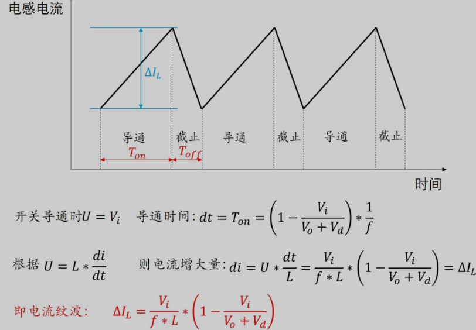

电感的纹波与负载电流没有关系

$$
\Delta IL=(0.2\sim 0.4)\times IL
$$

#### 电感值的计算

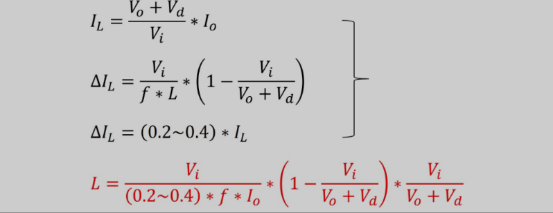

### 输入滤波电容

作用：输入电容控制输入电压的纹波

输入电压的纹波变化就是输入电容上的纹波变化

电容上的电压可以分为两个部分：电容充放电和电容的等效串联电阻ESR

电压的纹波就为$\Delta V_i=Uq+Uesr$（其中Uesr为ESR上的压降）

根据基尔霍夫定律，节点电流为0，电源输入电流恒定，那么电感电流变化量等于电容电流的变化量
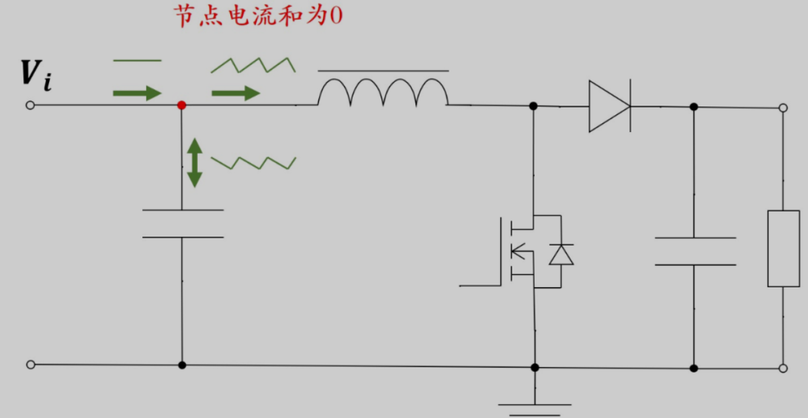
三者电流波形
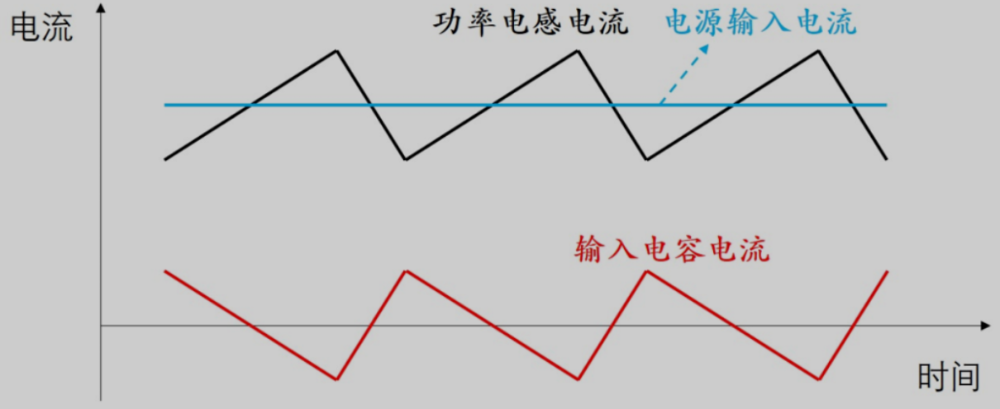
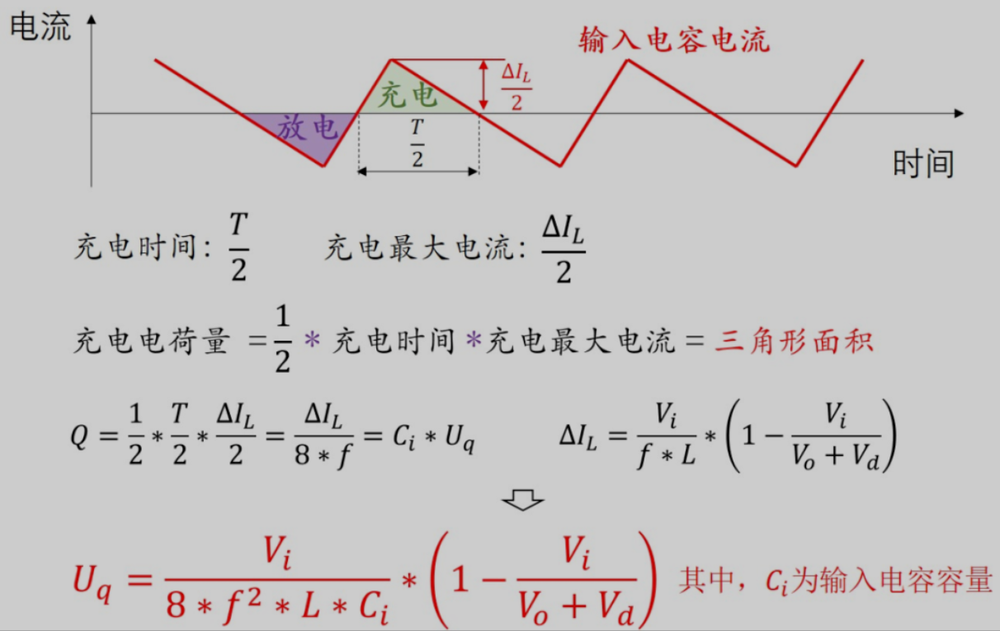

电流流过电容的ESR造成的压降User

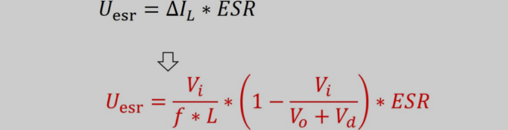

### 输出滤波电容

开关导通时，负载完全由$C_o$提供

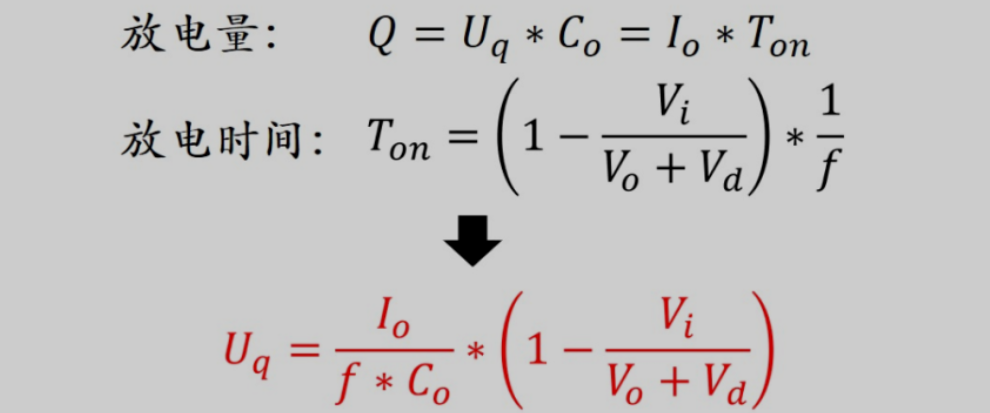

还有esr